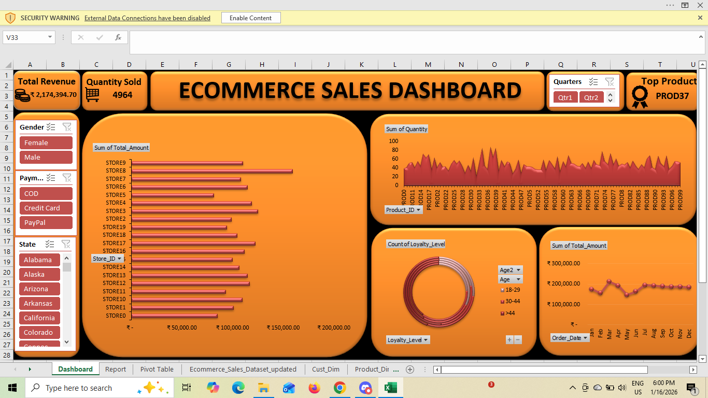

# 📊 E-Commerce Sales Dashboard

## 📌 Project Overview
This project analyzes **E-commerce sales data** to understand revenue trends, customer behavior, product performance, and store performance using **Excel Pivot Tables and an interactive dashboard**.

The dashboard provides quick insights into sales performance and helps businesses make **data-driven decisions**.

---

# 🎯 Objective
The objective of this project is to analyze e-commerce sales data to understand **revenue trends, customer behavior, product performance, and store performance using Excel pivot tables and interactive dashboards.**

---

# 📂 Dataset Description
The dataset contains four worksheets:

- `customer_dim`
- `sales_dim`
- `product_dim`
- `sales_fact`

The dataset includes **transaction-level e-commerce sales data** with the following fields:

Sales ID, Order Date, Customer ID, Gender, Loyalty Level, Age, State, Product ID, Store ID, Quantity, Unit Price, Discount, Payment Type, and Total Amount.

---

# 🧹 Data Cleaning
Data preparation was performed in **Excel**:

- Removed unwanted spaces
- Formatted date columns
- Converted discounts to percentages
- Handled missing values
- Converted columns to proper data types
- Ensured numerical consistency

---

# 📊 Pivot Table Analysis

### 1️⃣ Total Quantity Sold
Rows: Product_ID  
Values: Sum of Quantity  

### 2️⃣ Sales by Store
Rows: Store_ID  
Values: Sum of Quantity  

### 3️⃣ Payment Method Distribution
Rows: Payment_Type  
Values: Count of Payment_Type  

### 4️⃣ Sales Trend Over Time
Rows: Month  
Values: Sum of Total_Amount  

### 5️⃣ Loyalty Level by Age Group
Rows: Age Group  
Columns: Loyalty_Level  
Values: Sum of Total_Count  

---

# 📈 Dashboard Features

The dashboard includes:

✔ Total Revenue KPI  
✔ Total Quantity Sold KPI  
✔ Monthly Sales Trend  
✔ Sales by Product  
✔ Sales by Store  
✔ Loyalty Level by Age Group  

### 🎛 Interactive Filters (Slicers)

- Quarter
- Gender
- Payment Type
- State

---

# 🔍 Key Insights

### Product Performance
Most products sell between **40–60 units**, indicating a balanced product portfolio.  
**PROD37** is the most demanded product with **87 units sold**.

### Store Performance
Most stores generate between **₹100,000 – ₹120,000**, indicating stable performance across locations.

### Payment Trends
Customers use **COD, Credit Card, and PayPal almost equally**.  
Digital payments account for **67% of orders**.

### Sales Trend
Sales rise from **February to March**, dip in **May**, and remain strong from **July to December**.

### Customer Loyalty
Customers **above 44 years** show the strongest loyalty with the highest **Gold and Platinum memberships**.

---

# 🛠 Tools Used

- Microsoft Excel
- Pivot Tables
- Pivot Charts
- Slicers
- Excel Dashboard

---

# 📷 Dashboard Preview

---

# 📌 Conclusion

The analysis identified **top-performing products, high-performing stores, and customer purchase patterns**.  
The dashboard enables **data-driven decisions for improving sales and marketing strategies.**

---

# 👩‍💻 Author

**Kamali K**

Aspiring **Data Analyst | SQL | Excel | Power BI | Python | Data Visualization**
